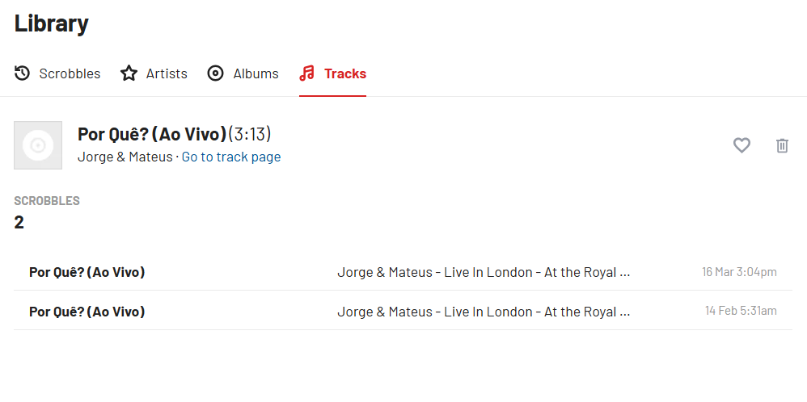
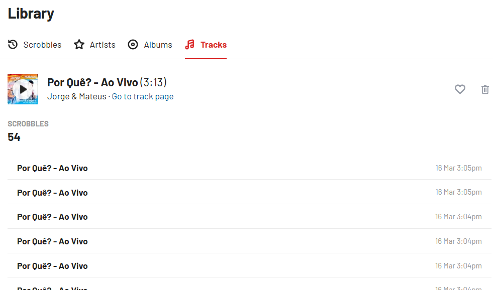
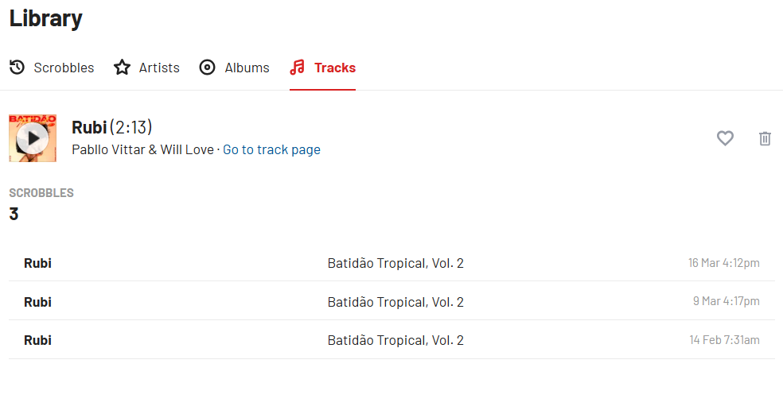
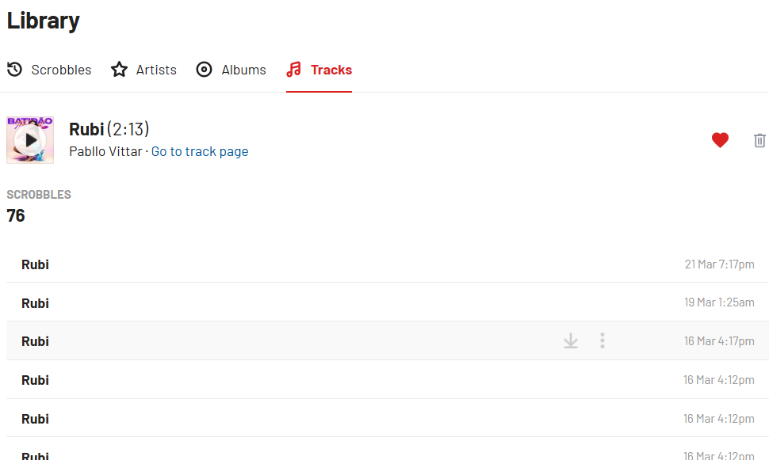

# last.fm Scrobble Cluster
A tool to ***clean*** ~~(kind of)~~ your **last.fm history** by **merging duplicate tracks' scrobbles**. It re-scrobble tracks that were **mistakenly scrobbled** under a **different URL** with a lower playcount, consolidating them into the URL with the **highest playcount**.

In short, [lastfm-scrobbles-cluster](https://github.com/tarcizoneto/lastfm-scrobbles-cluster) can be used when the **same track** appears in **multiple scrobble pages**, but it should exist as a **single page**, this script **merges** their scrobbles together.

### Notes
- DO **NOT** erase any .json files from data/ after they have been created;
- Since last.fm API / pylast only allows scrobbling tracks from now up to 14 days ago, your scrobble history may look a little unusual. 
- This tool can **NOT** erase scrobbles, and so last.fm API does not have a support for it, so, **be aware** that your scrobbles **will remain duplicated**, but the improper ones will be re-scrobbled in *the right way*

## Usage
1. [Create an API account in last.fm](https://www.last.fm/api/account/create) or [check your created ones](https://www.last.fm/api/accounts);
2. Edit `.envexample`, rename it to `.env` and fill in the constants.
3. Install requirements 

    ```bash
    pip install -r requirements.txt
    ```
  4. Run! 
		```bash
		py main.py
		```


## Features

- Grabs your **top tracks** all time history to compare which duplicate track has the highest playcount);
- Grabs your **recent tracks** history since the last time you've used the tool *(or all time, if are using it for the first time)* to gather the history of scrobbles on a track and to *try to* cronologically re-scrobble it

Detects almost any type of duplicate tracks by: 
- detecting possible lookalikes by **comparing eachother track title and tags** *(ignoring the way the tags is delimited)*;
- detecting **exact same** tracks titles in different URLs in the user's scrobble history;
-  detecting wrong **artist assignment** *(as in songs that were created in a collaboration between artists*).

*After all that,* it **selects** the page that has **the highest playcount** and **re-scrobbles the *improper* scrobbles.**


## Applications
*When I switched from Spotify to Apple Music, some of the tracks that I were listened were being scrobbled in a new page, and not in the already existent, so it created two different clusters, and the highest playcount page wasn't being used.*
> Most commom causes of duplicate tracks between Apple Music and Spotify:
>> Tags delimitation
> * In *Apple Music*, the majority of **song tags** are delimited by **(** *tags* **)**, as in this tracks' page: 
>  
>  
>  * And in Spotify, the majority of **song tags** are delimited by  *songname* **-** *tags*, as in this tracks' page: 
>  
>  
- Even when there are **slight changes** in a track title, **last.fm** can **not** **detect** if there is already an **existent page** with older scrobbles in a **different title**, *it* takes the **easy way out** and creates new track pages at every minimum change of the title, **creating a bunch of scrobble clusters**.
>> Artists in a collaboration track
> - *Note on the artist names:*
> *(Apple Music)*
> 
> *(Spotify)*
>
- Perhaps, this is a problem in AM's official scrobbler, instead of **scrobbling on the page of the main artist**, the scrobbles appears in a **new page**, with the exact same track name, but with all the **artists merged with "&"**


*I hate when these duplicate pages are created, and, as I am a *LOVER* of ranking tracks in last.fm, this tool is really useful for me by merging those.*

## TODO

 - [ ] Add GUI
 - [ ] Find a legal way of deleting the improper scrobbles
 - [ ] Find a way of scrobble using timestamp from more than two weeks
